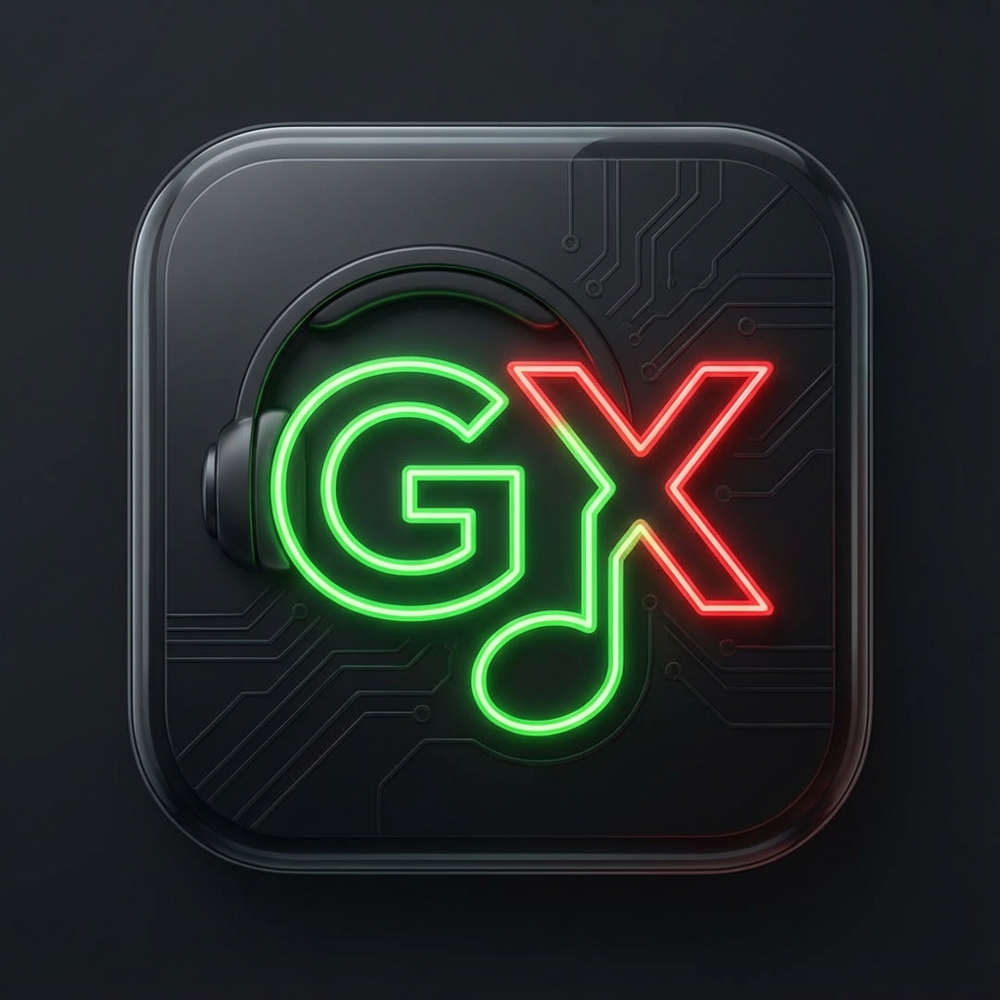

# 🎵 GamerX Music

<div align="center">



**A beautiful, feature-rich YouTube Music client for Android**

[](https://github.com/GamerX3560/GamerX-Music/releases)
[](LICENSE)
[](https://www.android.com)
[](https://kotlinlang.org)

[Features](#-features) • [Screenshots](#-screenshots) • [Download](#-download) • [FAQ](#-faq) • [License](#-license)

</div>

---

## ✨ Features

### 🎧 **Playback & Audio**
- 🚫 **Ad-free streaming** from YouTube Music
- 🎵 **Background playback** with notification controls
- 🎚️ **Audio quality selection** (up to 256kbps)
- ⚡ **Gapless playback** for seamless listening
- ⏰ **Sleep timer** with customizable duration
- 🔀 **Crossfade** between tracks
- 📊 **Replay gain** normalization
- 🎛️ **Equalizer** support

### 🎤 **Lyrics & Canvas**
- 📝 **Synced lyrics** from multiple sources
- 🌐 **Real-time translation** support
- 💾 **Offline lyrics** caching
- 🎨 **Spotify Canvas** - animated backgrounds
- 🔄 **Multiple providers**: YouTube, LRCLib, Spotify
- ✨ **Smooth scrolling** with beautiful animations

### 📱 **Library & Playlists**
- 📚 **Local playlists** with full control
- ☁️ **YouTube Music sync** - import your playlists
- ⬇️ **Download songs** for offline playback
- 🗂️ **Smart caching** system
- 🕐 **Recently played** tracking
- ❤️ **Favorites** and liked songs
- 🔍 **Advanced search** with filters

### 🎨 **Beautiful Interface**
- 🌈 **Material Design 3** with dynamic theming
- 🌙 **Dark mode** optimized
- 🎭 **Customizable home** with mood filters
- ✨ **Smooth animations** and transitions
- 🌫️ **Blur effects** and glassmorphism
- 🎯 **Intuitive navigation**

### 🔐 **Privacy & Accounts**
- 👤 **YouTube account login** for personalized experience
- 🎵 **Spotify integration** for enhanced features
- 🎮 **Discord Rich Presence** (optional)
- 🔒 **No tracking** - your data stays on your device
- 🛡️ **No analytics** or telemetry

### ⚙️ **Advanced Features**
- ⏭️ **SponsorBlock** - skip sponsored segments
- 🌐 **Piped instance** support
- 🔄 **Proxy support** for restricted regions
- 💾 **Backup & restore** your library
- 🌍 **Multi-language** support
- 🎚️ **Audio normalization** and effects
- 📊 **Detailed statistics**

---

## 📸 Screenshots

<div align="center">

| Home Screen | Now Playing | Lyrics | Library |
|------------|-------------|--------|---------|
|  |  |  |  |

*Beautiful Material Design 3 interface with smooth animations*

</div>

---

## 📥 Download

### Latest Release

**[📦 Download Latest Version](https://github.com/GamerX3560/GamerX-Music/releases/latest)**

### APK Variants

**Recommended for most users:**
- `GamerX-Music-universal.apk` - Works on all Android devices

**Smaller downloads (architecture-specific):**
- `GamerX-Music-arm64-v8a.apk` - For modern 64-bit devices (most phones)
- `GamerX-Music-armeabi-v7a.apk` - For older 32-bit devices
- `GamerX-Music-x86_64.apk` - For emulators and x86 devices

### System Requirements
- **Android**: 8.0 (Oreo) or higher
- **Storage**: ~150MB free space
- **Internet**: Required for streaming (offline playback available for downloaded songs)

---

## � Getting Started

### Installation

1. **Download** the APK from [Releases](https://github.com/GamerX3560/GamerX-Music/releases)
2. **Enable** "Install from Unknown Sources" in your device settings
3. **Install** the APK
4. **Open** GamerX Music and enjoy!

### First Time Setup

1. **Optional**: Log in with your YouTube account for personalized recommendations
2. **Browse** the home screen or search for your favorite music
3. **Create playlists** and download songs for offline listening
4. **Customize** the app in Settings to your liking

---

## ❓ FAQ

<details>
<summary><b>Is this app safe to use?</b></summary>

Yes! GamerX Music is open source and doesn't collect any personal data. All your music and playlists are stored locally on your device.
</details>

<details>
<summary><b>Do I need a YouTube Premium subscription?</b></summary>

No! GamerX Music provides ad-free streaming without requiring YouTube Premium.
</details>

<details>
<summary><b>Can I download songs for offline playback?</b></summary>

Yes! You can download any song, album, or playlist for offline listening.
</details>

<details>
<summary><b>Does it work without a YouTube account?</b></summary>

Yes, but logging in provides personalized recommendations and allows you to sync your YouTube Music playlists.
</details>

<details>
<summary><b>Why isn't the app on Google Play Store?</b></summary>

YouTube Music clients that bypass ads violate Google's terms of service and cannot be published on the Play Store.
</details>

<details>
<summary><b>How do I update the app?</b></summary>

Download the latest APK from the Releases page and install it over the existing app. Your data will be preserved.
</details>

---

## 🛠️ Troubleshooting

### App won't install
- Make sure you've enabled "Install from Unknown Sources"
- Uninstall any previous version if upgrading

### Playback issues
- Check your internet connection
- Try changing the audio quality in Settings
- Clear the app cache in Settings > Storage

### Login problems
- Make sure you're using a valid YouTube/Google account
- Try clearing app data and logging in again

### For other issues
- Check [existing issues](https://github.com/GamerX3560/GamerX-Music/issues)
- Create a [new issue](https://github.com/GamerX3560/GamerX-Music/issues/new) with details

---

## 📜 License

This project is licensed under the **GNU General Public License v3.0**.

```
GamerX Music - A YouTube Music client for Android
Copyright (C) 2025 Mangesh Choudhary

This program is free software: you can redistribute it and/or modify
it under the terms of the GNU General Public License as published by
the Free Software Foundation, either version 3 of the License, or
(at your option) any later version.

This program is distributed in the hope that it will be useful,
but WITHOUT ANY WARRANTY; without even the implied warranty of
MERCHANTABILITY or FITNESS FOR A PARTICULAR PURPOSE. See the
GNU General Public License for more details.
```

See the [LICENSE](LICENSE) file for the full license text.

---

## ⚠️ Disclaimer

**GamerX Music** is an **unofficial** YouTube Music client and is **not affiliated with, endorsed by, or connected to** YouTube, Google, or Alphabet Inc.

- All trademarks, service marks, and company names are the property of their respective owners
- This app uses YouTube's internal API for streaming music
- Use at your own discretion and risk
- The developers are not responsible for any misuse of this application

---

## 🙏 Acknowledgments

This project wouldn't be possible without:

- **YouTube Music** - For providing an amazing music streaming service
- **Google** - For Material Design and Android development tools
- **JetBrains** - For Kotlin and development tools
- **Open Source Community** - For the incredible libraries and frameworks

### Key Libraries Used
- Jetpack Compose - Modern UI toolkit
- Kotlin Coroutines - Asynchronous programming
- Media3 - Media playback
- Room - Local database
- Ktor - Networking
- Coil - Image loading
- Koin - Dependency injection

---

## 📞 Support & Contact

- **Developer**: Mangesh Choudhary
- **GitHub**: [@GamerX3560](https://github.com/GamerX3560)
- **Issues**: [Report bugs or request features](https://github.com/GamerX3560/GamerX-Music/issues)
- **Discussions**: [Join the community](https://github.com/GamerX3560/GamerX-Music/discussions)

---

## 🌟 Show Your Support

If you like GamerX Music, please consider:

- ⭐ **Starring** this repository
- 🐛 **Reporting bugs** to help improve the app
- 💡 **Suggesting features** you'd like to see
- 📢 **Sharing** with friends who love music

---

<div align="center">

### Made with ❤️ by Mangesh Choudhary

**Enjoy your music! 🎵**

[](https://github.com/GamerX3560/GamerX-Music/stargazers)
[](https://github.com/GamerX3560/GamerX-Music/network/members)

</div>
